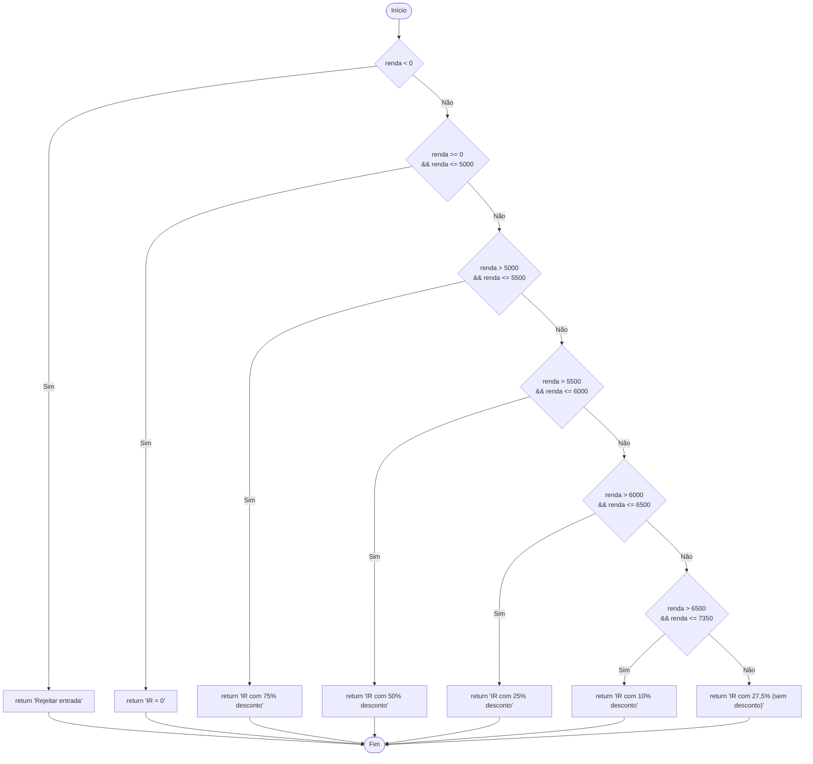

# Qualidade e Testes de Software - Cálculo do Imposto de Renda (IR)

Este repositório contém a entrega das atividades práticas da disciplina de Qualidade e Testes de Software, especificamente a implementação do cálculo do Imposto de Renda (IR), a modelagem do seu Grafo de Fluxo de Controle (GFC) e a geração de testes de unidade.

## Cabeçalho da Atividade

* **Curso:** Desenvolvimento de Software Multiplataforma
* **Ano/Semestre:** 2026/1
* **Professor(a):** Wilson Vendramel
* **Disciplina:** Qualidade e Testes de Software
* **Trabalho:** Mapa Conceitual, Casos de Teste e Inspeção de Software

### Equipe

* Camille Alves Cruz - RA: 2571392322027
* Gustavo Henrique Santana dos Santos - RA: 2571392322020
* Isaías Belarmina de Souza - RA: 2571392322003
* Victor Tavares Chaves - RA: 2571392322038

## Resumo do Projeto

Este projeto atende a duas questões principais solicitadas na avaliação:

1. **Implementação do Cálculo do IR e GFC:**
   Implementação do algoritmo de cálculo do Imposto de Renda em Java. O código-fonte principal contém blocos e desvios devidamente enumerados para representar os caminhos executáveis do Grafo de Fluxo de Controle (GFC).

2. **Testes de Unidade:**
   Geração de testes de unidade utilizando a ferramenta **JUnit**. Os casos de teste foram elaborados levando em consideração as partições de equivalência e os caminhos executáveis obtidos no GFC, validando o cálculo do imposto para diferentes faixas salariais.

## Estrutura e Execução

O código do algoritmo principal assim como as suítes de testes estão organizados em um projeto Java padrão.
Certifique-se de possuir o Java e as dependências do JUnit configuradas para executar e validar as rotinas de teste da aplicação.
